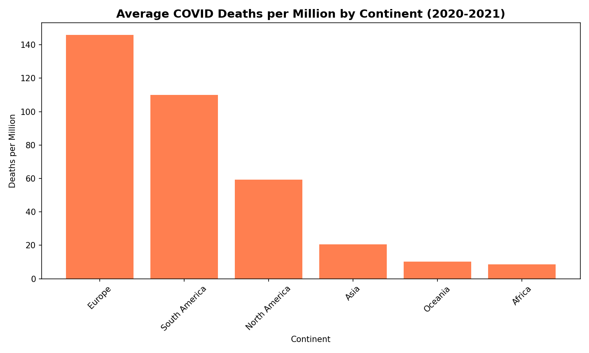
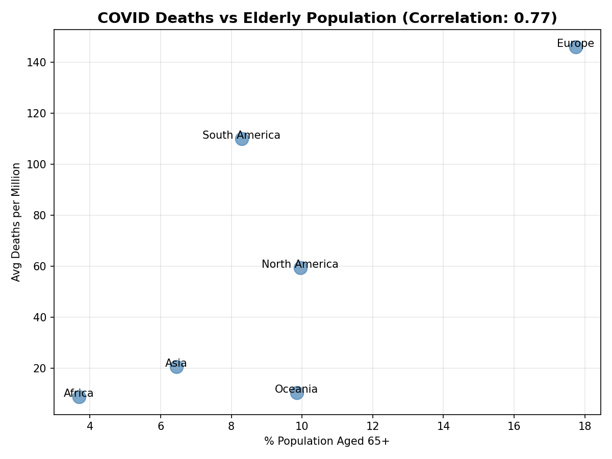

## Summary
I analyzed 40,000+ global COVID-19 records from "Our World in Data" to quantify the relationship between population demographics and pandemic mortality rates. Identified a strong correlation (r=0.77) between elderly population percentage and death rates, which reveals critical insights for public health resource allocation.

## Key Public Health Findings

### 1. Massive Regional Mortality Disparities
- **Europe experienced 17x higher death rates** than Africa (146 deaths/million vs 8.67 deaths/million)
- South America and North America showed intermediate rates (110 and 59 deaths/million respectively)
- **Implication:** Regional healthcare capacity and demographic structure significantly impact outcomes

### 2. Demographic Risk Correlation
- **Strong positive correlation (0.768)** between percentage of population aged 65+ and COVID mortality
- Europe's elderly population (17.74% aged 65+) correlated with highest death rates
- Africa's younger demographics (3.69% aged 65+) associated with lowest mortality
- **Implication:** Age distribution is a primary predictor of pandemic vulnerability

### 3. Continental Performance Analysis
- **Asia:** 20.45 deaths/million despite moderate elderly population (6.45%)
- **Oceania:** 10.23 deaths/million with effective containment strategies
- **Africa:** Youngest population contributed to lowest mortality burden
- **Implication:** Demographic factors interact with healthcare infrastructure and policy response

## Visualizations

### Average Deaths per Million by Continent

*Europe and Americas account for majority of per-capita COVID mortality*

### Correlation: Mortality vs Elderly Population

*Strong linear relationship (r=0.77) validates age as key risk factor*

## Technical Implementation

**Data Processing:**
- Python (Pandas) for cleaning 44,785 records across 41 variables
- SQL (SQLite) for continent-level aggregations and statistical queries
- Date filtering focused on 2020-2021 pandemic period for relevance

**Statistical Methods:**
- Pearson correlation coefficient for demographic-mortality relationship
- GROUP BY aggregations for continental performance comparison
- NULL handling and data validation for robust analysis

**Visualizations:**
- Matplotlib bar charts for regional comparisons
- Scatter plots with continent labels for correlation analysis
- Color-coded visualizations for stakeholder clarity

## Dataset Details

**Source:** Our World in Data (OWID) COVID-19 Dataset  
**Size:** 44,785 rows × 41 columns  
**Variables:** Cases, deaths, testing rates, demographics, healthcare capacity  
**Time Range:** 2020-2021 (early pandemic through vaccine rollout)
**Download:** [OWID COVID Data on Kaggle](https://www.kaggle.com/datasets/bolkonsky/covid19)

## Public Health Implications

**Resource Allocation Insights:**
- Countries with aging populations should prioritize elderly protection measures
- Healthcare infrastructure gaps in high-mortality regions require targeted support
- Demographic data enables predictive modeling for future pandemic preparedness

**Policy Recommendations:**
- Age-stratified intervention strategies for regions with >15% elderly population
- Enhanced monitoring systems for continents with healthcare capacity constraints
- International cooperation to share best practices from low-mortality regions

## Statistical Validation

**Correlation Strength:** r = 0.768 (strong positive correlation)  
**Sample Size:** 40,102 records after filtering for data quality  
**Confidence:** Demographic patterns consistent across all 6 continents

## How to Run
```bash
# Install required libraries
pip install pandas matplotlib sqlite3

# Download dataset from Kaggle (link above)
# Place 'owid-covid-data.csv' in project folder

# Execute analysis
python covid_viz.py
```

**Expected Output:**
- SQL query results showing continental death rates
- Pearson correlation coefficient (0.768)
- Two publication-ready PNG visualizations

## Key Insights for Data Analysis

My goal through this project is to demonstrate these skills:
- **Data cleaning** on large real-world datasets (40K+ rows)
- **SQL proficiency** with complex aggregations and GROUP BY operations
- **Statistical thinking** through correlation analysis and hypothesis validation
- **Communication skills** via clear visualizations and actionable insights

## Author

**Abdoul Rahim Ousseini**  
Northwestern University | Computer Science + Mathematics  
[LinkedIn](https://www.linkedin.com/in/abdoul-rahim-ousseini-246854245/) | [GitHub](https://github.com/abdoulousseini2028-droid)

---

## Project Context

Developed as part of data analytics portfolio demonstrating ability to:
- Work with messy real-world public health data
- Apply statistical methods to validate hypotheses
- Translate complex findings into stakeholder-ready insights
- Use industry-standard tools (Python, SQL, Matplotlib)

**Related Projects:**
- [Superstore Sales Analysis](link-to-other-repo) - Business analytics and profitability optimization
```
